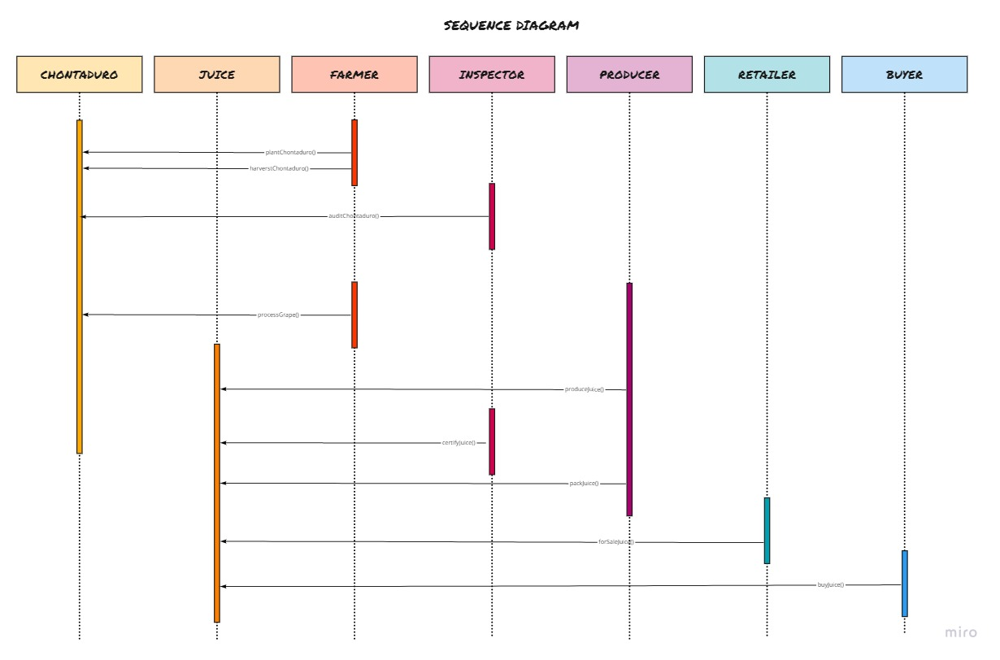
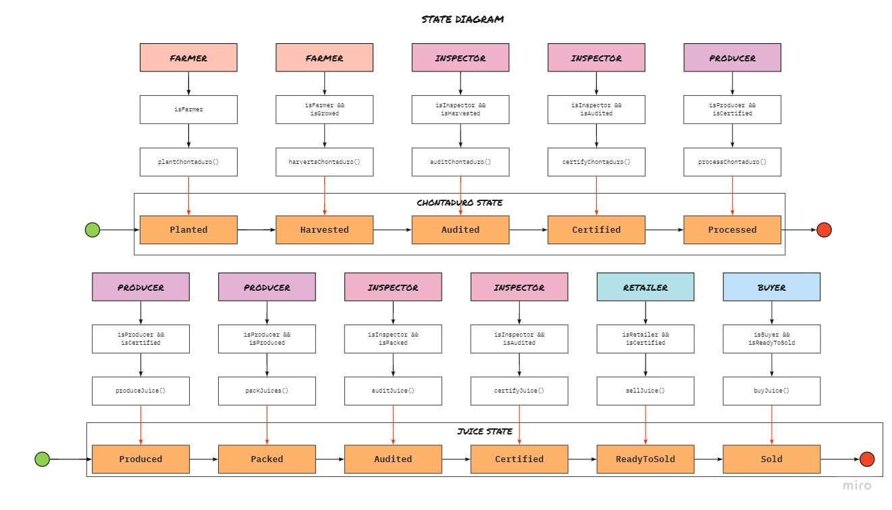
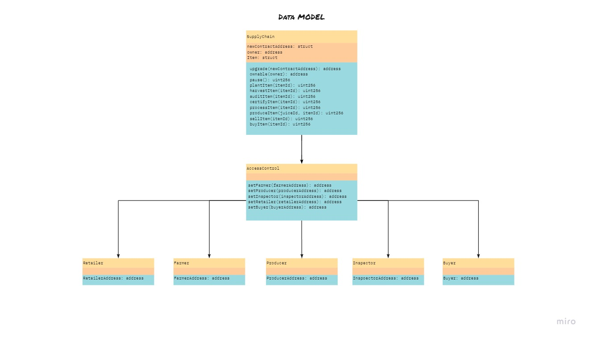

# 🏋️ DApp for Tracking Items in a Supply Chain

For this project you will creating a DApp supply chain solution backed by the Ethereum platform. You will architect smart contracts that manage specific user permission controls as well as contracts that track and verify a product's authenticity.

## 🔖 TODO
 - [x] Plan the project with write-ups
 - [x] Write smart contract
 - [x] Test smart contract code coverage
 - [x] Deploy smart contracts on public test network (Rinkeby)
 - [x] Modify client code to interact with smart contracts
 - [ ] (Optional) Implement infura to store product image (Not used in the project)

## ✅ Rubric Request

1. `truffle` v5.4.23 installed globally
2. `openzeppelin-solidity` v2.3.0
3. `truffle-assertions`: v0.9.2 for use convenience function for solidity assertions
3. `truffle-hdwallet-provider`: v1.0.17, for enable the spend of test coins from metamask
4. `web3`: v1.3.5
4. Your Token Address on the Rinkeby Network Infura: 8f0afa0a1ab9431b85f86db7e3170265 
5. MetaMask account: 0xE4feA204E68Ba4F91FC6014fA712132086255CA4
## ✅ Testing the App

Currently I'm getting the next error:

```
home/suabochica/.nvm/versions/node/v14.15.4/lib/node_modules/truffle/build/459.bundled.js:27073
        throw new Error("Could not find artifacts for " + import_path + " from any sources");
        ^

Error: Could not find artifacts for ConvertLib from any sources
```

but honestly I don't know the cause

## ✅ UML Diagrams

### Activity


### Sequence



### State


### Data Model



## ✅ General Write Up

The project was done following the next steps:

1. Plan the project: Create the UML diagrams and describe the used libraries
2. Write smart contracts: Based on the specifications, the contracts were separated in three domains: `SupplyChain`, `Ownable`, `AccessControl`
3. Test the smart contract: For some reason, the error specified in the respective section is causing a blocker
4. Deploy smart contract on Rinkeby via truffle and infura
5. Build the frontend

Rinkeby contract address: `c276d395a07b486ebec66211bfab9ce2`

