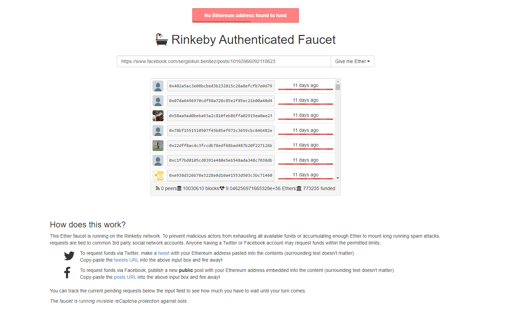

# 🏋 Udacity Blockchain Capstone

The capstone will build upon the knowledge you have gained in the course in order to build a decentralized housing product. 

## ⚙️ Test Environment

This repository contains Smart Contract code in Solidity (using Truffle), tests (also using Truffle), dApp scaffolding (using HTML, CSS and JS) and server app scaffolding.

To install, download or clone the repo, and execute the next steps:

Install dependencies:

`npm install`

Compile the contract:

`truffle compile`

Start Ganache

`ganache-cli`

In other terminal run:

`truffle test`

## 🚀 Deploy


Install dependencies:

`npm install`

Compile the contract:

`truffle compile`

Add your mnemonic in a new `.secret` file in the project root


Migrate to rinkeby

`truffle migrate --network rinkeby`

Below is shared **Verifier** and **SolnSquareVerifier** addresses:

```
2_deploy_contracts.js
=====================

   Deploying 'Verifier'
   --------------------
   > block number:        10119848
   > block timestamp:     1644120064
   > account:             0xE4feA204E68Ba4F91FC6014fA712132086255CA4
   > address:             0xe858286C7DFD3d03Fe1A790f8917D5BB271E6e48
   > balance:             0.196838112491146715
   > gas used:            992455 (0xf24c7)
   > gas price:           2.500000007 gwei
   > value sent:          0 ETH
   > total cost:          0.002481137506947185 ETH


   Deploying 'SolnSquareVerifier'
   ------------------------------
   > block number:        10119849
   > block timestamp:     1644120068
   > account:             0xE4feA204E68Ba4F91FC6014fA712132086255CA4
   > address:             0xD706d4cD4f46111eFAb5564586CF162e6b288450
   > balance:             0.186253327461509317
   > gas used:            4233914 (0x409aba)
   > gas price:           2.500000007 gwei
   > value sent:          0 ETH
   > total cost:          0.010584785029637398 ETH

   -------------------------------------
   > Total cost:     0.013065922536584583 ETH

Summary
=======
> Total deployments:   3
> Final cost:          0.013632265038170342 ETH
```

## 🕹️ Zokrates

Run the zokrates docker image:

```
docker run -v ~/Development/blockchain-nanodegree/projects/05-project-capstone/zokrates/code:/home/zokrates/code -ti zokrates/zokrates:0.3.0 /bin/bash
```
> Note: use the version `0.3.0` of zokrates generates the expected outputs

Compile the program

```
cd code
~/zokrates compile -i square/square.code
```

Generate the trusted zokrates setup

```
~/zokrates setup
```

Compute the witness for your desired pair of numbers under the format `number square` (e.g 3 9)

```
~/zokrates compute-witness -a 3 9
```

Generate the proof:

```
~/zokrates generate-proof
```

At this point there should be a `proof.json` file that contains `ProofA[]`, `ProofB[]` fields that can be used in the approve solution.

If you want, generate the ~Verifier.sol~ contract with:

```
~/zokrates export-verifier
```
## 🕹️ ABI

You can check the abis in the `/build` folder.

## 🌊 OpenSea

```
Owner Wallet Address:
0xE4feA204E68Ba4F91FC6014fA712132086255CA4

Buyer Wallet Address:
0x53FECf832d291F0C3d43f06E3BE1a459adE7b1f2

```

[EtherScan](https://rinkeby.etherscan.io/address/0xe4fea204e68ba4f91fc6014fa712132086255ca4)

NFT links:

- [Water House](https://testnets.opensea.io/assets/0x88b48f654c30e99bc2e4a1559b4dcf1ad93fa656/103577226846465686377519928044988398376835694479848581002288206161382146572289/)
- [Terracota House](https://testnets.opensea.io/assets/0x88b48f654c30e99bc2e4a1559b4dcf1ad93fa656/103577226846465686377519928044988398376835694479848581002288206164680681455617/)
- [Pink House](https://testnets.opensea.io/assets/0x88b48f654c30e99bc2e4a1559b4dcf1ad93fa656/103577226846465686377519928044988398376835694479848581002288206163581169827841/)
- [Air House](https://testnets.opensea.io/assets/0x88b48f654c30e99bc2e4a1559b4dcf1ad93fa656/103577226846465686377519928044988398376835694479848581002288206162481658200065)
- [Encanto House](https://testnets.opensea.io/assets/0x88b48f654c30e99bc2e4a1559b4dcf1ad93fa656/103577226846465686377519928044988398376835694479848581002288206165780193083393/)

Purchased Tokens:

- [Pink House](https://rinkeby.etherscan.io/tx/0x6ba893068dc0217d60ee4005c20f3967d5e35b7a70c050388b3ff4fc104afc6d)
- [Encanto House](https://rinkeby.etherscan.io/tx/0x163b0b3150ac10e5449600c773ac3d9e10e0b559c58c994006decb76933477f9)

### ⚠️ Troubleshot

I can't purchased my NFTs in Open Sea because when I try to get ETH in my metamask account from [faucet rinkeby](https://faucet.rinkeby.io/) via this [facebook post](https://www.facebook.com/sergiokun.benitez/posts/10165966092110623) I got the next error:



> Solution: get test funds form [faucets chain](https://faucets.chain.link/rinkeby)

When run the command to check the test

```
truffle test
```

I got the next error:

```
❯ truffle test ./test/TestSquareVerifier.js 
Using network 'development'.


Compiling your contracts...
===========================
> Everything is up to date, there is nothing to compile.

Error: 
    at Deployer._preFlightCheck (/home/suabochica/.nvm/versions/node/v14.15.4/lib/node_modules/truffle/build/webpack:/packages/deployer/src/deployment.js:179:1)
    at processTicksAndRejections (internal/process/task_queues.js:93:5)
    at /home/suabochica/.nvm/versions/node/v14.15.4/lib/node_modules/truffle/build/webpack:/packages/deployer/src/deployment.js:282:1
    at Migration._deploy (/home/suabochica/.nvm/versions/node/v14.15.4/lib/node_modules/truffle/build/webpack:/packages/migrate/Migration.js:70:1)
    at Migration._load (/home/suabochica/.nvm/versions/node/v14.15.4/lib/node_modules/truffle/build/webpack:/packages/migrate/Migration.js:56:1)
    at Migration.run (/home/suabochica/.nvm/versions/node/v14.15.4/lib/node_modules/truffle/build/webpack:/packages/migrate/Migration.js:217:1)
    at Object.runMigrations (/home/suabochica/.nvm/versions/node/v14.15.4/lib/node_modules/truffle/build/webpack:/packages/migrate/index.js:150:1)
    at Object.runFrom (/home/suabochica/.nvm/versions/node/v14.15.4/lib/node_modules/truffle/build/webpack:/packages/migrate/index.js:110:1)
    at Object.runAll (/home/suabochica/.nvm/versions/node/v14.15.4/lib/node_modules/truffle/build/webpack:/packages/migrate/index.js:114:1)
    at Object.run (/home/suabochica/.nvm/versions/node/v14.15.4/lib/node_modules/truffle/build/webpack:/packages/migrate/index.js:79:1)
    at Object.run (/home/suabochica/.nvm/versions/node/v14.15.4/lib/node_modules/truffle/build/webpack:/packages/core/lib/testing/Test.js:114:1)
    at Object.run (/home/suabochica/.nvm/versions/node/v14.15.4/lib/node_modules/truffle/build/webpack:/packages/core/lib/commands/test/index.js:182:1)
    at Command.run (/home/suabochica/.nvm/versions/node/v14.15.4/lib/node_modules/truffle/build/webpack:/packages/core/lib/command.js:183:1)
Truffle v5.4.23 (core: 5.4.23)
Node v14.15.4
```

> Solution: update the tests
## 🧭 Resources

* [Remix - Solidity IDE](https://remix.ethereum.org/)
* [Visual Studio Code](https://code.visualstudio.com/)
* [Truffle Framework](https://truffleframework.com/)
* [Ganache - One Click Blockchain](https://truffleframework.com/ganache)
* [Open Zeppelin ](https://openzeppelin.org/)
* [Interactive zero knowledge 3-colorability demonstration](http://web.mit.edu/~ezyang/Public/graph/svg.html)
* [Docker](https://docs.docker.com/install/)
* [ZoKrates](https://github.com/Zokrates/ZoKrates)
